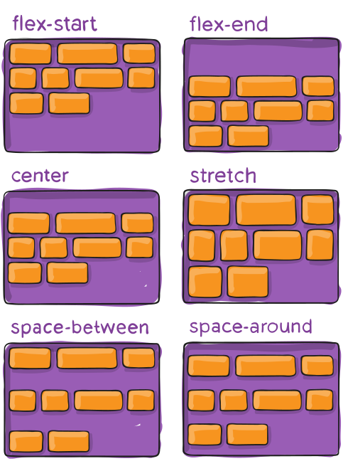

<style>
.example {
  border: 1px dashed #555;
  margin-bottom: 1.5rem;
  padding: 3px;
}
</style>

No podríamos explicarlo mejor que
[aquí](https://css-tricks.com/snippets/css/a-guide-to-flexbox/).

**Flexbox** es una característica medianamente moderna (CSS3) que solventa el
problema de utilizar columnas, anchos y márgenes porcentuales, no poder centrar
elementos correctamente, entre otras cosas. Y todo esto desde CSS.

Este módule fue propuesto por la W3C en 2017. Su principal función es proveer un
modo más eficiente para diseñar, alinear y distribuir el espacio entre items
dentro de un contenedor, incluso cuando su tamaño es desconocido o dinámico.

La principal idea detrás de **Flexbox** es dotar al contenedor con la habilidad
de alterar el tamaño y posición de sus items hijos (internos) para que ocupen de
la mejor forma el espacio disponible. Expande items para llenar el espacio o los
encoge para prevenir *overflow*.

Es agnóstico a la dirección, diferente a los métodos regulares de
posicionamiento.

Básicamente su uso depende de definir un contenedor y sus items o elementos
internos. El contenedor dispondrá sus elementos hijos de forma horizontal o
vertical. Además, define el ancho e incluso el alto de cada item. Por su parte,
cada item puede establecer su propio estilo para posición y tamaño,
sobreescribiendo al del contenedor o padre.


Como medida de tamaño y posición utiliza fracciones, por ejemplo `1fr`. Como
punto importante, el navegador se encarga de realizar la mayoría de los cálculos
en cuanto a tamaño por nosotros.

```html
<style>
.contenedor {
  display: flex; /* establece el uso de flexbox dentro del contenedor */
}
</style>
<div class="contenedor">
  <div class="item">Item 1</div>
  <div class="item">Item 2</div>
  <div class="item">Item 2</div>
</div>
```

<div class="example">
  <style>
  .contenedor {
    display: flex; /* establece el uso de flexbox dentro del contenedor */
  }
  .item {
    background-color: #999;
    padding: 5px;
    width: 64px;
    margin: 9px;
  }
  </style>
  <div class="contenedor">
    <div class="item">Item 1</div>
    <div class="item">Item 2</div>
    <div class="item">Item 2</div>
  </div>
</div>

Hay que resaltar que automáticamente nuestros items se alinearon horizontalmente
con sólo cambiar el `display` del contenedor padre. Y no tuvimos que utilizar
ningún *hack*.

## Contenedor

Es el elemento padre, quien contendrá cada item.

Establece el comportamiento general de sus items, asignándole dirección, tamaño
y posición.

```css
.contenedor {
  display: flex;
  
  flex-direction: row | row-reverse | column | column-reverse;
  
  flex-wrap: nowrap | wrap | wrap-reverse;
  
  flex-flow: <‘flex-direction’> || <‘flex-wrap’>
  
  justify-content: flex-start | flex-end | center | space-between | space-around | space-evenly;
  
  align-items: stretch | flex-start | flex-end | center | baseline;

  align-content: flex-start | flex-end | center | space-between | space-around | stretch;
}
```

**flex-direction**


**flex-wrap**


**justify-content**


**align-items**


**align-content**


## Item

Es cada elemento particular dentro del padre.

```css
.item {
  order: <integer>; /* default is 0 */

  flex-grow: <number>; /* default 0 */
  
  flex-shrink: <number>; /* default 1 */

  flex: none | [ <'flex-grow'> <'flex-shrink'>? || <'flex-basis'> ]

  align-self: auto | flex-start | flex-end | center | baseline | stretch;
}
```

**order**


**flex-grow**


**align-self**


Para continuar aprendiendo sobre esta maravillosa característica ve a
[CSS-Tricks](https://css-tricks.com/snippets/css/a-guide-to-flexbox/).
