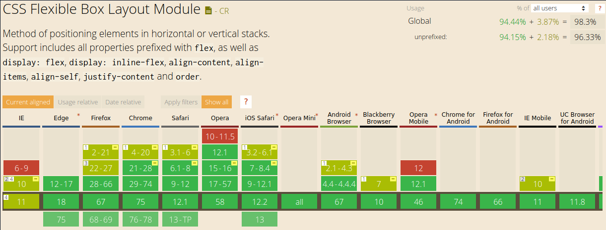

Como hemos visto CSS es un lenguaje con características muy interesante. Sin
embargo, ha ido evolucionando y mejorando con el tiempo.

Hace años era necesario utilizar algunos *hacks* para lograr los resultados
esperados. Sobre todo era complicado lograr la alineación y posición deseada.
Incluso se solía maquetar y alinear el contenido de una página web abusando de
la etiqueta `<table>` ya que facilitaba el posicionamiento de elementos al
contemplar todo como una celda dentro de una tabla.

Existe una propiedad llamada `veritcal-align`. A pesar de su nombre, sólo
funciona correctamente con tablas. Entonces si queríamos centrar un item
verticalmente, además de los trucos que vimos anteriormente, debíamos agregar un
contenedor del tipo tabla.

Hoy en día ese tipo de técnicas se sigue utilizando. ¿Por qué? Por
retrocompatibilidad con navegadores antiguos o dispositivos con poco poder de
procesamiento.

Algo importante a considerar sobre las nuevas características y módulos que se
agregan a CSS es la compatibilidad. Podemos hacer uso de la página [Can I
use?](https://caniuse.com/) para consultar si determinada característica es
compatible con versiones antiguas de los distintos navegadores.

Por ejemplo, hoy en día **Flexbox** es altamente compatible, pero hace algún
tiempo esto no era así. Así que depende de los requerimientos del sitio web qué
características vamos a utilizar.

Para solventar esto y utilizar técnicas nuevas de CSS que sean compatibles con
versiones antiguas de los navegadores, algunas características tienen librerías
denominadas *polyfills* que de alguna forma simulan el comportamiento haciendo
uso de otras características antiguas. Simplemente debemos *importarlas* en
nuestra página.

Por otro lado, todos los navegadores tienen un estilo definido por defecto. Es
decir, aquellas propiedades que no establezcamos en nuestro CSS serán
establecidas por el mismo navegador. El problema aquí es que este estilo por
defecto es distinto y depende de cada navegador, y esto puede hacer que la
página web que estemos desarrollando se vea distinto en Mozilla Firefox y en
Google Chrome, por ejemplo. ¿La solución? Incorporar librerías que se encargan
de *resetear* el estilo general del navegador para que se vea igual en todos
lados. [Modernizr](https://modernizr.com/) y
[reset.css](https://meyerweb.com/eric/tools/css/reset/) proveen esta función.

## Características importantes

Y por último, nos gustaría resaltar dos características interesantes a tener en cuenta:

- [CSS Grid](https://css-tricks.com/snippets/css/complete-guide-grid/)
- [Animaciones](https://www.w3schools.com/css/css3_animations.asp)
- [Variables](https://developer.mozilla.org/es/docs/Web/CSS/Using_CSS_custom_properties):
  así es, actualmente CSS soporta variables. Permite generalizar aún más nuestro
  código y hacerlo configurable.

Nos gustaría hacer hincapié en **CSS Grid**. Una nueva forma de alinear y
posicionar elementos. Los métodos que tratamos en los capítulos anteriores
consideran un sola dimensión: fila horizontal o columna vertical.

Si quisíeramos posicionar 4 items en una grilla de 2x2 deberíamos crear dos
filas con dos columnas, lo que implica más código HTML del realmente necesario
para definir nuestro contenido. CSS Grid permite configurar el espacio en 2D, en
forma de grilla, como su nombre lo indica.

CSS Grid está aumentando su compatibilidad con los navegadores más populares.

La diferencia entre CSS Grid y Flexbox es que este último fue pensado para
diseños pequeños, en cambio, CSS Grid viene a solucionar un gran problema:
definir *layouts* generales, poder alinear los elementos generales de cualquier
sitio, y armar la plantilla principal con pocas líneas de CSS.

Para poner un ejemplo, con pocas líneas y CSS Grid podemos armar la plantilla
principal de un sitio web: barras de navegación, menúes, contenido principal,
*widgets* y pie de página. Todo esto pensando el sitio como realmente se ve, en
2 dimensiones.
